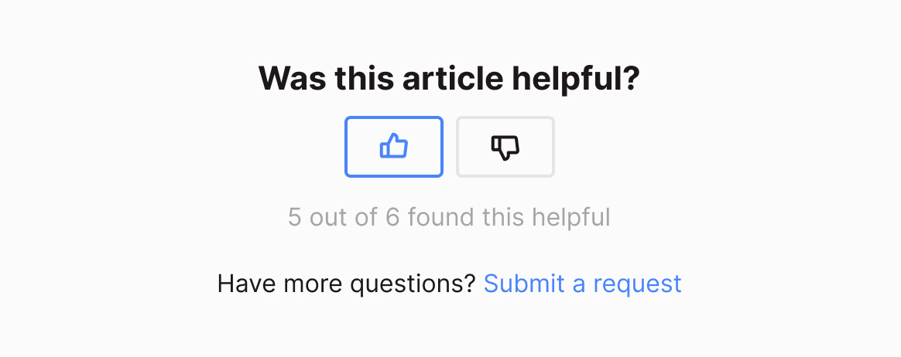

# Voting Buttons

In this challenge, we’ll build out voting buttons.

## Design

Using whatever design tool you’re most comfortable with, create a simple voting buttons component. Attempt to mimic the following design as closely as possible.

### Font
- Inter: https://fonts.google.com/specimen/Inter
- Varients:
  - Bold 21px
  - Regular 16px

### Colors
- Background: #FBFBFB
- Light: #E6E5E5
- Muted: #A8A4A4
- Text: #1D1818
- Accent: #C84444
- Link: #4985FA

### Icons
- https://phosphoricons.com/
- Size: 20px by 20px
- Local versions included in this branch

### Keep it 💯 Challenge (extra challenge)
- Prototype the buttons in your design program