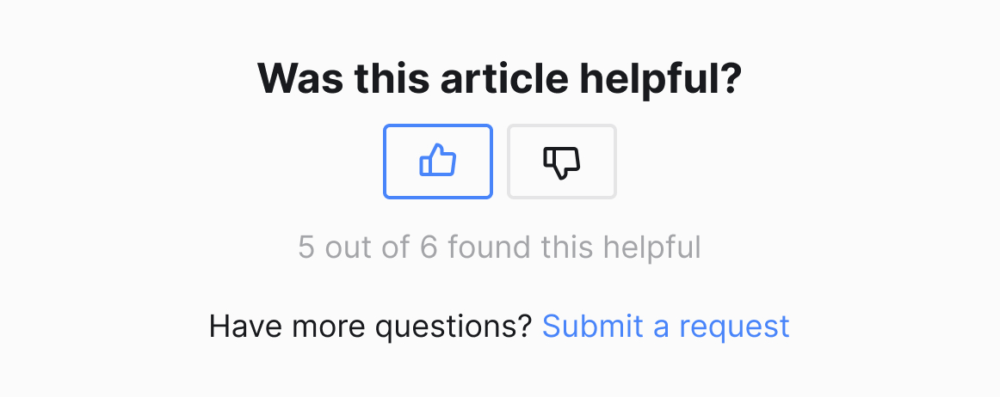

# Voting Buttons

In this challenge, we’ll build out voting buttons.

## Code

Using whatever method you’re most comfortable with, code a simple voting buttons component. Attempt to mimic the following design as closely as possible. If you didn’t do your own design, you can use the attached Figma or example.jpg.

### Font
- Inter: https://fonts.google.com/specimen/Inter
- Varients:
  - Bold 24px
  - Regular 18px

### Colors
- Background: #FBFBFB
- Light: #E5E5E6
- Muted: #A4A5A8
- Text: #181A1D
- Accent: #4985FA

### Icons
- https://phosphoricons.com/
- Size: 24px by 24px
- Local versions included in this branch

### Functionality
- When a button is clicked, focused, or hovered, it should show as selected in the UI.
- Both buttons cannot be selected at the same time, so that clicking one should untoggle the other.
- The UI numbers should update accordingly:
  -  “5 out of 6” if neither is selected
  -  “6 out of 7” if the like button is selected
  -  “5 out of 7” if the disliked button is selected

### Keep it 💯 Challenge (extra challenge)
- Add keyboard event listeners so you can toggle between the buttons with the right and left arrow keys.